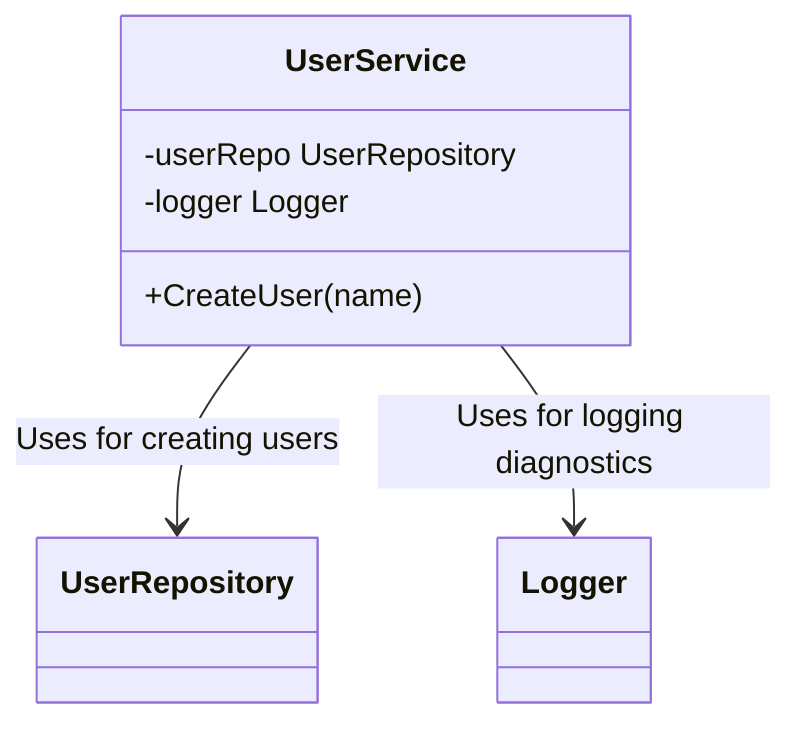

+++
title = 'Collaborator'
date = 2026-07-25
slug = 'collaborator'
url = '/glossary/collaborator'
resources = ['glossary']
tags = ['collaborator', 'testing']
toc = false
+++

A **collaborator** is an object that another object depends on and talks to in
order to perform its function -- a dependency it delegates part of a job to. If
a `ReportService` asks a `Clock` for the time and a `Repository` for the
records, the clock and the repository are its collaborators.

<!--more-->

Collaborators generally focus on _behavioral interactions_ rather than ownership
and structure. From a design or modeling standpoint, it's a logical and abstract
entity rather than a concretion. Mechanically, this is typically implemented
using .

This term is used extensively through the Matt Pages as a means of conveying
something that is a logical dependency and provides a specific behavior for a
unit.


The term **collaborator** is _common_ in Object-Oriented-Design or Domain-Driven
design literature, but it may be foreign to the average developer.

It is still a helpful descriptor that otherwise doesn't have a great parallel
with other terms.


Since the Matt Pages preach only _Best Practices™_, architecture discussed in
any resource will be following , and
as such almost all dependencies _should_ be essential collaborators. This comes
for free thanks to having well-defined and focused responsibilities.

## How this different from a "dependency"?

The terms are related but not interchangeable.

* A **dependency** is a _structural relationship_: one component _requires_
  another.
* A **collaborator** is a _behavioral relationship_: two components
  _work together_ to perform a task.

As an example, imaging you have an object like:

Suppose `CreateUser` only calls `userRepo` during the operation, while `logger`
is only used for diagnostics. If discussing the behavior of `CreateUser`, you
might say:

* `UserRepository` is a _collaborator_ in the user creation use case.
* `Logger` is a _dependency_, but not an _essential collaborator_ in the
  business logic.

## References

*  -- the "collaboration" in CRC: a class's collaborators
   are often dependencies, but with an emphasis is on _behavioral interaction_
   rather than ownership.
