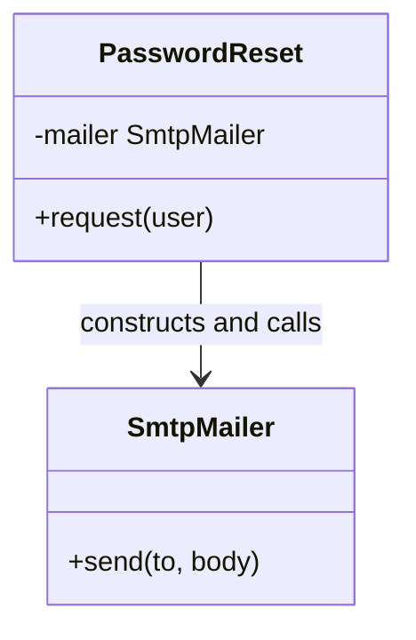
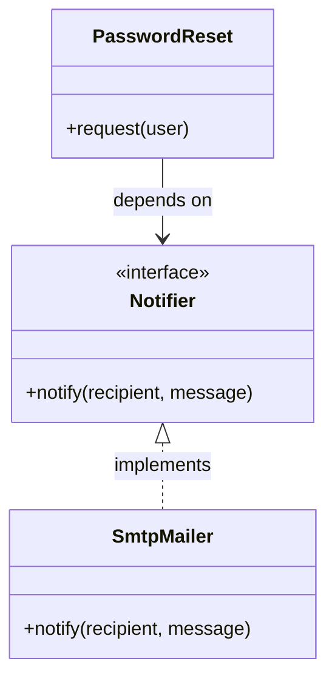

+++
title = 'Dependency Inversion Principle'
date = 2026-07-25
slug = 'dependency-inversion-principle'
url = '/glossary/dependency-inversion-principle'
resources = ['glossary']
tags = ['solid', 'dependency-inversion-principle', 'design']
toc = false
+++

The **Dependency Inversion Principle** (DIP) is the "D" in the
. It states that
high-level modules should not depend on low-level modules -- both should depend
on an abstraction -- and that abstractions should not depend on details. The
"inversion" is that the low-level detail ends up depending on an interface owned
by the policy, rather than the policy depending on the detail.

<!--more-->

## Why it matters

A high-level module encodes _policy_ -- what the system does. A low-level module
is a _detail_ -- how a particular step is carried out. When the policy reaches
down and constructs a concrete detail, it welds the two together: the interesting
logic now cannot exist without that exact database, that exact mail server, that
exact clock. You cannot swap the detail for another, and you cannot exercise the
policy in a test without dragging the real detail along with it.

Pointing both sides at an abstraction breaks the weld. The policy depends on an
interface it defines in its own terms; the detail implements that interface. Now
the detail can be replaced -- a different provider, or a
 in a test -- without the
policy noticing. DIP is the principle;
 is the
usual mechanism that realizes it, supplying the concrete implementation from
outside rather than letting the policy build one.

## Example

Consider a password-reset policy that needs to send a message. Constructing the
SMTP mailer inside the policy ties the two together permanently.




```cpp
class SmtpMailer {
public:
  auto send(const std::string& to, const std::string& body) -> void { /* ... */ }
};

// High-level policy welded to the low-level detail it constructs.
class PasswordReset {
public:
  auto request(const std::string& user) -> void {
    m_mailer.send(user, "Reset your password: ...");
  }

private:
  SmtpMailer m_mailer;
};
```




```go
package auth

type SMTPMailer struct{}

func (SMTPMailer) Send(to, body string) { /* ... */ }

// PasswordReset is welded to the low-level detail it constructs.
type PasswordReset struct {
  mailer SMTPMailer
}

func NewPasswordReset() *PasswordReset {
  return &PasswordReset{mailer: SMTPMailer{}}
}

func (p *PasswordReset) Request(user string) {
  p.mailer.Send(user, "Reset your password: ...")
}
```




```python
class SmtpMailer:
  def send(self, to: str, body: str) -> None: ...


# High-level policy welded to the low-level detail it constructs.
class PasswordReset:
  def __init__(self) -> None:
    self._mailer = SmtpMailer()

  def request(self, user: str) -> None:
    self._mailer.send(user, "Reset your password: ...")
```




```rust
pub struct SmtpMailer;

impl SmtpMailer {
  pub fn send(&self, to: &str, body: &str) { /* ... */ }
}

/// High-level policy welded to the low-level detail it constructs.
pub struct PasswordReset {
  mailer: SmtpMailer,
}

impl PasswordReset {
  pub fn new() -> Self {
    Self { mailer: SmtpMailer }
  }

  pub fn request(&self, user: &str) {
    self.mailer.send(user, "Reset your password: ...");
  }
}
```




If we represent this graphically, we'll immediately notice that the arrow
_points the wrong way_:



The policy depends on the implementation detail, so switching to SMS, batching
sends, or testing the reset flow without a live mail server all mean editing
`PasswordReset`:

If we break this up with an abstraction based around the behavior, we would
land with a `Notifier` abstraction -- and this inverts that dependency. The
policy now only depends on `Notifier`, which is _implemented_ by `SmtpMailer`:



With this inversion, the caller is now responsible for supplying the concrete
notifier from outside:




```cpp
class Notifier {
public:
  virtual ~Notifier() = default;
  virtual auto notify(const std::string& recipient, const std::string& message) -> void = 0;
};

class SmtpMailer final : public Notifier {
public:
  auto notify(const std::string& recipient, const std::string& message) -> void override { /* ... */ }
};

class PasswordReset {
public:
  explicit PasswordReset(Notifier& notifier) : m_notifier(&notifier) {}

  auto request(const std::string& user) -> void {
    m_notifier->notify(user, "Reset your password: ...");
  }

private:
  Notifier* m_notifier;
};
```




```go
package auth

type Notifier interface {
  Notify(recipient, message string)
}

type SMTPMailer struct{}

func (SMTPMailer) Notify(recipient, message string) { /* ... */ }

type PasswordReset struct {
  notifier Notifier
}

func NewPasswordReset(notifier Notifier) *PasswordReset {
  return &PasswordReset{notifier: notifier}
}

func (p *PasswordReset) Request(user string) {
  p.notifier.Notify(user, "Reset your password: ...")
}
```




```python
from typing import Protocol


class Notifier(Protocol):
  def notify(self, recipient: str, message: str) -> None: ...


class SmtpMailer:
  def notify(self, recipient: str, message: str) -> None: ...


class PasswordReset:
  def __init__(self, notifier: Notifier) -> None:
    self._notifier = notifier

  def request(self, user: str) -> None:
    self._notifier.notify(user, "Reset your password: ...")
```




```rust
pub trait Notifier {
  fn notify(&self, recipient: &str, message: &str);
}

pub struct SmtpMailer;

impl Notifier for SmtpMailer {
  fn notify(&self, recipient: &str, message: &str) { /* ... */ }
}

pub struct PasswordReset<N: Notifier> {
  notifier: N,
}

impl<N: Notifier> PasswordReset<N> {
  pub fn new(notifier: N) -> Self {
    Self { notifier }
  }

  pub fn request(&self, user: &str) {
    self.notifier.notify(user, "Reset your password: ...");
  }
}
```




This inversion now allows:

* **Better testability:** We can easily create a
   to simulate the real
  object in tests, instead of relying on the SMTP implementation concretely,
  and

* **Better scalability:** By working with an abstraction, we can now easily
  create _new_ `Notifier` instances, such as an SMS notifier, phone call
  notifier, smoke signal, etc.

The rest of SOLID comes along with it. `Notifier` has a single method, satisfying
;
any notifier that honors the contract is
, so an
SMS notifier or a test double drops in without editing `PasswordReset`, which is
. Policy and
transport are now separate units, each with
.
In practice you reach DIP through
 -- the
caller constructs the notifier and passes it in.

## References

*  -- Martin's original article on inverting the
  direction of source-code dependencies through abstractions.
*  -- overview, including who should own the abstraction
  and how it differs from dependency injection.
*  -- how injection supplies the concrete detail that
  DIP tells you to depend on abstractly.
