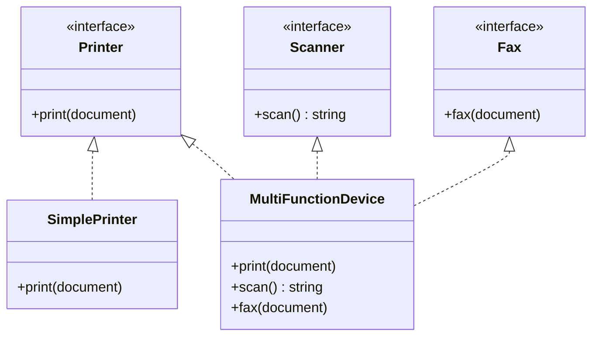

+++
title = 'Interface Segregation Principle'
date = 2026-07-25
slug = 'interface-segregation-principle'
url = '/glossary/interface-segregation-principle'
resources = ['glossary']
tags = ['solid', 'interface-segregation-principle', 'design']
toc = false
+++

The **Interface Segregation Principle** (ISP) is the "I" in the
. It states that
no client should be forced to depend on methods it does not use. Prefer several
small, focused abstractions over one large one, so that each consumer depends
only on the operations it actually calls.

<!--more-->

## Why it matters

A "fat" interface couples every client to every method on it, including the ones
it never touches. A consumer that only needs to print now depends on `scan` and
`fax` as well: a change to the fax signature ripples into code that has nothing
to do with faxing, and every implementer -- even a plain printer -- is forced to
supply all three operations. The methods it cannot support get stubbed out to
throw, which quietly turns an ISP violation into a

violation: an object that claims to be the type but blows up when half of it is
called.

Splitting the interface along the lines of how it is actually used removes that
coupling. Each client depends on a small role, each implementer supports exactly
the roles it can honor, and a device that only prints simply is not a scanner.
The abstractions become the natural, single-purpose seams the rest of a SOLID
design is built from.

## Example

Consider office devices modelled behind one `Machine` interface covering
printing, scanning, and faxing. A printer that cannot scan or fax still has to
implement those methods.




```cpp
class Machine {
public:
  virtual ~Machine() = default;
  virtual auto print(const std::string& document) -> void = 0;
  virtual auto scan() -> std::string = 0;
  virtual auto fax(const std::string& document) -> void = 0;
};

class SimplePrinter final : public Machine {
public:
  auto print(const std::string& document) -> void override { /* ... */ }
  auto scan() -> std::string override {
    throw std::logic_error("not supported");
  }
  auto fax(const std::string&) -> void override {
    throw std::logic_error("not supported");
  }
};

auto print_report(Machine& machine, const std::string& document) -> void {
  machine.print(document);
}
```




```go
package office

type Machine interface {
  Print(document string)
  Scan() string
  Fax(document string)
}

type SimplePrinter struct{}

func (SimplePrinter) Print(document string) { /* ... */ }
func (SimplePrinter) Scan() string          { panic("not supported") }
func (SimplePrinter) Fax(document string)   { panic("not supported") }

func PrintReport(machine Machine, document string) {
  machine.Print(document)
}
```




```python
from typing import Protocol


class Machine(Protocol):
  def print(self, document: str) -> None: ...
  def scan(self) -> str: ...
  def fax(self, document: str) -> None: ...


class SimplePrinter:
  def print(self, document: str) -> None: ...

  def scan(self) -> str:
    raise NotImplementedError("not supported")

  def fax(self, document: str) -> None:
    raise NotImplementedError("not supported")


def print_report(machine: Machine, document: str) -> None:
  machine.print(document)
```




```rust
pub trait Machine {
  fn print(&self, document: &str);
  fn scan(&self) -> String;
  fn fax(&self, document: &str);
}

pub struct SimplePrinter;

impl Machine for SimplePrinter {
  fn print(&self, document: &str) { /* ... */ }
  fn scan(&self) -> String {
    unimplemented!("not supported")
  }
  fn fax(&self, document: &str) {
    unimplemented!("not supported")
  }
}

pub fn print_report(machine: &impl Machine, document: &str) {
  machine.print(document);
}
```




`print_report` needs only printing, yet it depends on the whole `Machine`
interface, and `SimplePrinter` is dragged into implementing `scan` and `fax` just
to satisfy the type.

Segregating the roles removes the dead dependencies. Each capability is its own
single-method abstraction; a device implements only what it can do, and a client
depends only on the role it needs.

Instaed, imagine if a printer is a `Printer`, a combo device implements all
three roles, and no type is forced to fake a capability it lacks:



In code, this would look like:




```cpp
class Printer {
public:
  virtual ~Printer() = default;
  virtual auto print(const std::string& document) -> void = 0;
};

class Scanner {
public:
  virtual ~Scanner() = default;
  virtual auto scan() -> std::string = 0;
};

class Fax {
public:
  virtual ~Fax() = default;
  virtual auto fax(const std::string& document) -> void = 0;
};

class SimplePrinter final : public Printer {
public:
  auto print(const std::string& document) -> void override { /* ... */ }
};

class MultiFunctionDevice final : public Printer, public Scanner, public Fax {
public:
  auto print(const std::string& document) -> void override { /* ... */ }
  auto scan() -> std::string override { /* ... */ }
  auto fax(const std::string& document) -> void override { /* ... */ }
};

auto print_report(Printer& printer, const std::string& document) -> void {
  printer.print(document);
}
```




```go
package office

type Printer interface {
  Print(document string)
}

type Scanner interface {
  Scan() string
}

type Fax interface {
  Fax(document string)
}

type SimplePrinter struct{}

func (SimplePrinter) Print(document string) { /* ... */ }

type MultiFunctionDevice struct{}

func (MultiFunctionDevice) Print(document string) { /* ... */ }
func (MultiFunctionDevice) Scan() string          { return "" }
func (MultiFunctionDevice) Fax(document string)   { /* ... */ }

func PrintReport(printer Printer, document string) {
  printer.Print(document)
}
```




```python
from typing import Protocol


class Printer(Protocol):
  def print(self, document: str) -> None: ...


class Scanner(Protocol):
  def scan(self) -> str: ...


class Fax(Protocol):
  def fax(self, document: str) -> None: ...


class SimplePrinter:
  def print(self, document: str) -> None: ...


class MultiFunctionDevice:
  def print(self, document: str) -> None: ...
  def scan(self) -> str: ...
  def fax(self, document: str) -> None: ...


def print_report(printer: Printer, document: str) -> None:
  printer.print(document)
```




```rust
pub trait Printer {
  fn print(&self, document: &str);
}

pub trait Scanner {
  fn scan(&self) -> String;
}

pub trait Fax {
  fn fax(&self, document: &str);
}

pub struct SimplePrinter;

impl Printer for SimplePrinter {
  fn print(&self, document: &str) { /* ... */ }
}

pub struct MultiFunctionDevice;

impl Printer for MultiFunctionDevice {
  fn print(&self, document: &str) { /* ... */ }
}

impl Scanner for MultiFunctionDevice {
  fn scan(&self) -> String { /* ... */ String::new() }
}

impl Fax for MultiFunctionDevice {
  fn fax(&self, document: &str) { /* ... */ }
}

pub fn print_report(printer: &impl Printer, document: &str) {
  printer.print(document);
}
```




These single-method roles are exactly the abstractions the other principles rely
on. `print_report` depends on `Printer` alone rather than a concrete device --

-- and because no implementer has to stub a method it cannot support, every type
is genuinely 
for its role. Each role captures one responsibility, and new device types plug in
without editing the consumer, giving

and  in the same
move.

## References

*  -- Martin on keeping interfaces small so clients
  are not coupled to operations they never call.
*  -- overview with the original Xerox printer example
  that motivated the principle.
