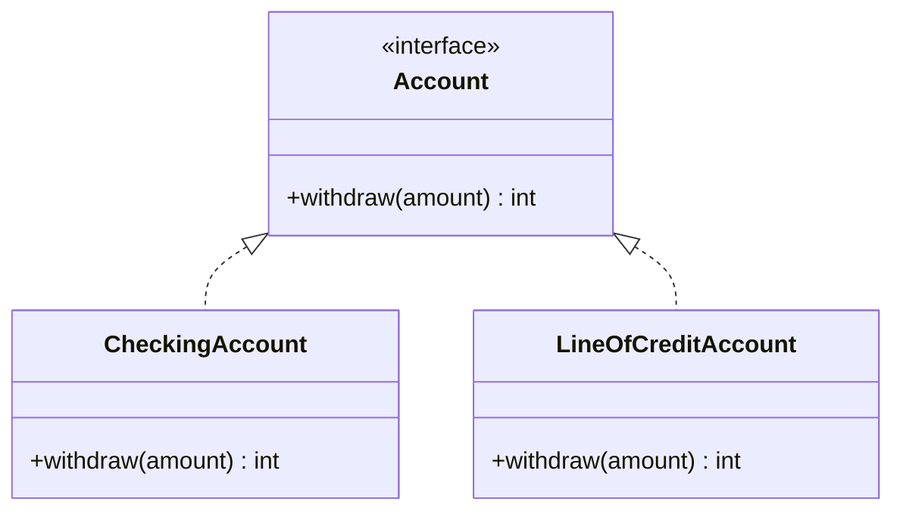
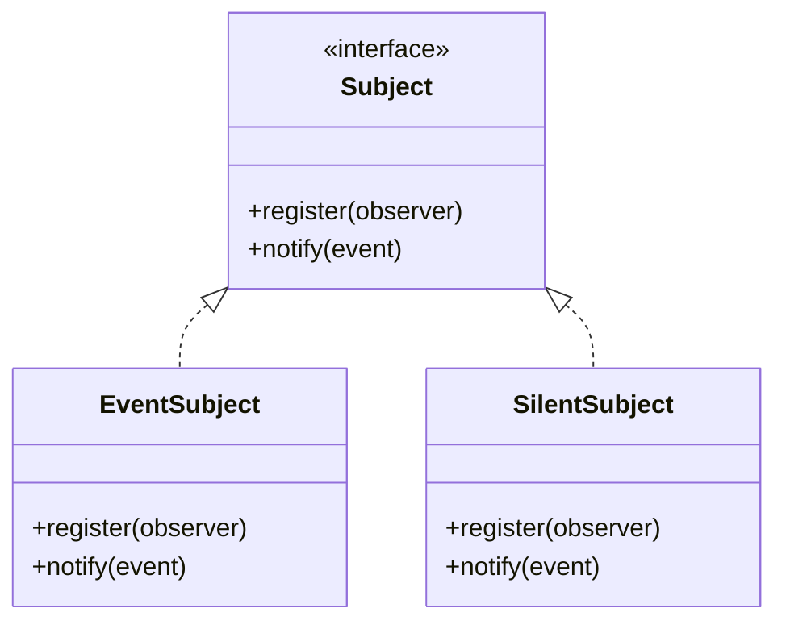
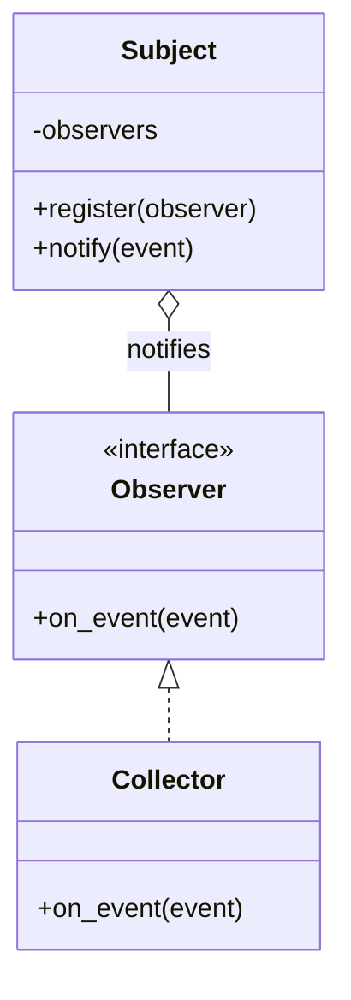

+++
title = 'Liskov Substitution Principle'
date = 2026-07-25
slug = 'liskov-substitution-principle'
resources = ['glossary']
tags = ['solid', 'liskov-substitution-principle', 'design']
toc = false
+++

The **Liskov Substitution Principle** (LSP) is the "L" in the
. It states that
an object of a supertype must be replaceable by an object of any subtype without
breaking the program. A subtype has to honor the supertype's _contract_: it may
not strengthen what the caller must provide, nor weaken what the caller is
promised in return.

<!--more-->

## Why it matters

Substitutability is what makes polymorphism trustworthy. When a function accepts
an abstraction, it reasons about the contract of that abstraction, not the
concrete type it is handed. If some implementation quietly breaks the contract --
throws where the contract promises success, returns a value the contract rules
out -- then every call through the abstraction becomes a landmine, and callers
start adding type checks to defend themselves. That is the opposite of what the
abstraction was for.

The contract rules are precise. A subtype:

* may not _strengthen a precondition_ (reject inputs the supertype accepts),
* may not _weaken a postcondition_ (return less than the supertype guarantees), and
* must preserve the supertype's invariants.

A subtype is free to do the reverse -- accept _more_ inputs or guarantee _more_
about its output -- because existing callers keep working. LSP is also what
makes 
safe: extending a system with new implementations only works if each one is
genuinely substitutable.

## Example

Consider an `Account` abstraction whose single `withdraw` method is documented
to succeed for any amount up to the balance. A payout routine leans on that
contract to draw from a list of accounts.




```cpp
class Account {
public:
  virtual ~Account() = default;
  // Withdraws `amount` and returns the new balance. Any amount up to the
  // current balance is permitted.
  virtual auto withdraw(int amount) -> int = 0;
};

class CheckingAccount final : public Account {
public:
  explicit CheckingAccount(int balance) : m_balance(balance) {}
  auto withdraw(int amount) -> int override {
    m_balance -= amount;
    return m_balance;
  }

private:
  int m_balance;
};

// Strengthens the precondition: rejects withdrawals the contract allows.
class FixedDepositAccount final : public Account {
public:
  explicit FixedDepositAccount(int balance) : m_balance(balance) {}
  auto withdraw(int) -> int override {
    throw std::logic_error("funds are locked until maturity");
  }

private:
  int m_balance;
};

auto payout(const std::vector<Account*>& accounts, int amount) -> void {
  for (auto* account : accounts) {
    account->withdraw(amount);  // throws for a FixedDepositAccount
  }
}
```




```go
package banking

// Account withdraws amount and returns the new balance. Any amount up to the
// current balance is permitted.
type Account interface {
  Withdraw(amount int) int
}

type CheckingAccount struct{ Balance int }

func (a *CheckingAccount) Withdraw(amount int) int {
  a.Balance -= amount
  return a.Balance
}

// FixedDepositAccount strengthens the precondition: it rejects withdrawals the
// Account contract allows.
type FixedDepositAccount struct{ Balance int }

func (a *FixedDepositAccount) Withdraw(amount int) int {
  panic("funds are locked until maturity")
}

func Payout(accounts []Account, amount int) {
  for _, account := range accounts {
    account.Withdraw(amount) // panics for a FixedDepositAccount
  }
}
```




```python
from typing import Protocol


class Account(Protocol):
  # Reduces the balance by `amount` and returns the new balance. Any amount up
  # to the current balance is permitted.
  def withdraw(self, amount: int) -> int: ...


class CheckingAccount:
  def __init__(self, balance: int) -> None:
    self.balance = balance

  def withdraw(self, amount: int) -> int:
    self.balance -= amount
    return self.balance


# Strengthens the precondition: rejects withdrawals the contract allows.
class FixedDepositAccount:
  def __init__(self, balance: int) -> None:
    self.balance = balance

  def withdraw(self, amount: int) -> int:
    raise RuntimeError("funds are locked until maturity")


def payout(accounts: list[Account], amount: int) -> None:
  for account in accounts:
    account.withdraw(amount)  # raises for a FixedDepositAccount
```




```rust
pub trait Account {
  /// Reduces the balance by `amount` and returns the new balance. Any amount up
  /// to the current balance is permitted.
  fn withdraw(&mut self, amount: i64) -> i64;
}

pub struct CheckingAccount {
  pub balance: i64,
}

impl Account for CheckingAccount {
  fn withdraw(&mut self, amount: i64) -> i64 {
    self.balance -= amount;
    self.balance
  }
}

/// Strengthens the precondition: rejects withdrawals the contract allows.
pub struct FixedDepositAccount {
  pub balance: i64,
}

impl Account for FixedDepositAccount {
  fn withdraw(&mut self, _amount: i64) -> i64 {
    panic!("funds are locked until maturity");
  }
}

pub fn payout(accounts: &mut [Box<dyn Account>], amount: i64) {
  for account in accounts {
    account.withdraw(amount); // panics for a FixedDepositAccount
  }
}
```




`FixedDepositAccount` claims to be an `Account` but cannot honor the withdrawal
contract, so `payout` -- written against the abstraction -- blows up the moment
one is in the list. The only "fixes" available to the caller are to catch the
error or to sniff the concrete type, both of which defeat the point of coding to
`Account` at all.

The real fix is to stop forcing a type under a contract it cannot meet. `Account`
means "you can withdraw up to the balance"; only implementations that actually
support that belong under it. A locked deposit is a genuinely different
capability and should be modelled on its own, not smuggled in as an `Account`.

Note that widening the contract is fine: a `LineOfCreditAccount` that _also_
permits overdrafts accepts everything a plain `Account` does and more, so it
substitutes cleanly.




```cpp
class Account {
public:
  virtual ~Account() = default;
  virtual auto withdraw(int amount) -> int = 0;
};

class CheckingAccount final : public Account {
public:
  explicit CheckingAccount(int balance) : m_balance(balance) {}
  auto withdraw(int amount) -> int override {
    m_balance -= amount;
    return m_balance;
  }

private:
  int m_balance;
};

// Weakens the precondition -- overdrafts are allowed -- which is substitutable.
class LineOfCreditAccount final : public Account {
public:
  explicit LineOfCreditAccount(int balance) : m_balance(balance) {}
  auto withdraw(int amount) -> int override {
    m_balance -= amount;
    return m_balance;
  }

private:
  int m_balance;
};

auto payout(const std::vector<Account*>& accounts, int amount) -> int {
  int total = 0;
  for (auto* account : accounts) {
    account->withdraw(amount);
    total += amount;
  }
  return total;
}
```




```go
package banking

type Account interface {
  Withdraw(amount int) int
}

type CheckingAccount struct{ Balance int }

func (a *CheckingAccount) Withdraw(amount int) int {
  a.Balance -= amount
  return a.Balance
}

// LineOfCreditAccount widens the contract: overdrafts are allowed, so it still
// substitutes for any Account.
type LineOfCreditAccount struct{ Balance int }

func (a *LineOfCreditAccount) Withdraw(amount int) int {
  a.Balance -= amount
  return a.Balance
}

func Payout(accounts []Account, amount int) int {
  total := 0
  for _, account := range accounts {
    account.Withdraw(amount)
    total += amount
  }
  return total
}
```




```python
from typing import Protocol


class Account(Protocol):
  def withdraw(self, amount: int) -> int: ...


class CheckingAccount:
  def __init__(self, balance: int) -> None:
    self.balance = balance

  def withdraw(self, amount: int) -> int:
    self.balance -= amount
    return self.balance


# Widens the contract -- overdrafts are allowed -- so it still substitutes.
class LineOfCreditAccount:
  def __init__(self, balance: int) -> None:
    self.balance = balance

  def withdraw(self, amount: int) -> int:
    self.balance -= amount
    return self.balance


def payout(accounts: list[Account], amount: int) -> int:
  total = 0
  for account in accounts:
    account.withdraw(amount)
    total += amount
  return total
```




```rust
pub trait Account {
  fn withdraw(&mut self, amount: i64) -> i64;
}

pub struct CheckingAccount {
  pub balance: i64,
}

impl Account for CheckingAccount {
  fn withdraw(&mut self, amount: i64) -> i64 {
    self.balance -= amount;
    self.balance
  }
}

/// Widens the contract -- overdrafts are allowed -- so it still substitutes.
pub struct LineOfCreditAccount {
  pub balance: i64,
}

impl Account for LineOfCreditAccount {
  fn withdraw(&mut self, amount: i64) -> i64 {
    self.balance -= amount;
    self.balance
  }
}

pub fn payout(accounts: &mut [Box<dyn Account>], amount: i64) -> i64 {
  let mut total = 0;
  for account in accounts {
    account.withdraw(amount);
    total += amount;
  }
  total
}
```




Every implementation under `Account` now honors the same contract, so `payout`
can treat them uniformly:



This keeps the rest of SOLID intact. `Account` carries a single method, so it
satisfies ;
`payout` depends on that abstraction rather than concrete accounts, which is
;
and because substitution is safe, new account types can be added without touching
`payout`, giving .
LSP is the principle that keeps that extensibility from turning into a trap.

### Alternative

The account example breaks LSP by strengthening a precondition, which is the
textbook case. A subtler and far more common variant hides inside an interface
that bundles several methods with an _implied responsibility_ between them.
Consider a `Subject` from the observer pattern: it exposes `register` to add an
observer and `notify` to publish an event. Neither signature says anything about
the other, yet the whole point of the type is the promise that links them --
_what you register is what gets notified_. That promise lives nowhere the
compiler can see it, so an implementer can satisfy both method signatures while
doing none of what they imply.




```cpp
class Observer {
public:
  virtual ~Observer() = default;
  virtual auto on_event(const std::string& event) -> void = 0;
};

class Subject {
public:
  virtual ~Subject() = default;
  virtual auto register_observer(Observer* observer) -> void = 0;
  // Contract: every observer passed to register_observer is notified here.
  virtual auto notify(const std::string& event) -> void = 0;
};

class Collector final : public Observer {
public:
  auto on_event(const std::string& event) -> void override {
    m_events.push_back(event);
  }
  auto events() const -> const std::vector<std::string>& { return m_events; }

private:
  std::vector<std::string> m_events;
};

class EventSubject final : public Subject {
public:
  auto register_observer(Observer* observer) -> void override {
    m_observers.push_back(observer);
  }
  auto notify(const std::string& event) -> void override {
    for (auto* observer : m_observers) {
      observer->on_event(event);
    }
  }

private:
  std::vector<Observer*> m_observers;
};

// Satisfies both signatures, but notify is a no-op: registered observers are
// never told anything.
class SilentSubject final : public Subject {
public:
  auto register_observer(Observer*) -> void override {}
  auto notify(const std::string&) -> void override {}
};

auto publish(Subject& subject, const std::string& event)
    -> std::vector<std::string> {
  Collector collector;
  subject.register_observer(&collector);
  subject.notify(event);
  return collector.events();  // empty for a SilentSubject: nobody was notified
}
```




```go
package events

type Observer interface {
  OnEvent(event string)
}

// Subject registers observers; the contract is that every observer passed to
// Register is notified when Notify is called.
type Subject interface {
  Register(observer Observer)
  Notify(event string)
}

type Collector struct{ events []string }

func (c *Collector) OnEvent(event string) {
  c.events = append(c.events, event)
}

type EventSubject struct{ observers []Observer }

func (s *EventSubject) Register(observer Observer) {
  s.observers = append(s.observers, observer)
}

func (s *EventSubject) Notify(event string) {
  for _, observer := range s.observers {
    observer.OnEvent(event)
  }
}

// SilentSubject satisfies both signatures, but Notify is a no-op: registered
// observers are never told anything.
type SilentSubject struct{}

func (SilentSubject) Register(observer Observer) {}
func (SilentSubject) Notify(event string)        {}

func Publish(subject Subject, event string) []string {
  collector := &Collector{}
  subject.Register(collector)
  subject.Notify(event)
  return collector.events // empty for a SilentSubject: nobody was notified
}
```




```python
from typing import Protocol


class Observer(Protocol):
  def on_event(self, event: str) -> None: ...


class Subject(Protocol):
  def register(self, observer: Observer) -> None: ...
  # Contract: every observer passed to register is notified here.
  def notify(self, event: str) -> None: ...


class Collector:
  def __init__(self) -> None:
    self.events: list[str] = []

  def on_event(self, event: str) -> None:
    self.events.append(event)


class EventSubject:
  def __init__(self) -> None:
    self.observers: list[Observer] = []

  def register(self, observer: Observer) -> None:
    self.observers.append(observer)

  def notify(self, event: str) -> None:
    for observer in self.observers:
      observer.on_event(event)


# Satisfies both signatures, but notify is a no-op: registered observers are
# never told anything.
class SilentSubject:
  def register(self, observer: Observer) -> None: ...
  def notify(self, event: str) -> None: ...


def publish(subject: Subject, event: str) -> list[str]:
  collector = Collector()
  subject.register(collector)
  subject.notify(event)
  return collector.events  # empty for a SilentSubject: nobody was notified
```




```rust
use std::cell::RefCell;
use std::rc::Rc;

pub trait Observer {
  fn on_event(&self, event: &str);
}

pub trait Subject {
  fn register(&mut self, observer: Rc<dyn Observer>);
  /// Contract: every observer passed to `register` is notified here.
  fn notify(&self, event: &str);
}

pub struct Collector {
  pub events: RefCell<Vec<String>>,
}

impl Observer for Collector {
  fn on_event(&self, event: &str) {
    self.events.borrow_mut().push(event.to_string());
  }
}

pub struct EventSubject {
  observers: Vec<Rc<dyn Observer>>,
}

impl Subject for EventSubject {
  fn register(&mut self, observer: Rc<dyn Observer>) {
    self.observers.push(observer);
  }
  fn notify(&self, event: &str) {
    for observer in &self.observers {
      observer.on_event(event);
    }
  }
}

/// SilentSubject satisfies both signatures, but notify is a no-op: registered
/// observers are never told anything.
pub struct SilentSubject;

impl Subject for SilentSubject {
  fn register(&mut self, _observer: Rc<dyn Observer>) {}
  fn notify(&self, _event: &str) {}
}

pub fn publish(subject: &mut dyn Subject, event: &str) -> Vec<String> {
  let collector = Rc::new(Collector { events: RefCell::new(Vec::new()) });
  subject.register(collector.clone());
  subject.notify(event);
  collector.events.borrow().clone() // empty for a SilentSubject: nobody was notified
}
```




Both subjects satisfy the interface, yet `publish` -- which registers a collector
and then reads what it was told -- gets a populated result from `EventSubject`
and an empty one from `SilentSubject`. `SilentSubject` never broke a signature;
its `register` and `notify` both compile and return, they just do not uphold the
responsibility between them. A no-op is the starkest case, but the same interface
admits any number of others just as easily: a subject that notifies a hardcoded
observer instead of the ones registered, that keeps only the last registration,
or that forwards a different event than it was handed. Every one of them is a
valid `Subject`, and nothing in the type tells a caller which one it is holding.



The root cause is an

smell. `Subject` does not carry one operation; it carries two methods bound by an
_implied responsibility_ -- what you register is what gets notified -- and the
type system can only check the two method shapes, never the responsibility that
connects them. Any interface whose methods only mean something in relation to
each other is one that implementers can satisfy on the surface while doing
nothing behind it.

So the fix for the LSP violation runs through the ISP problem: stop modelling the
mechanism as a substitutable abstraction at all. The register/notify machinery
has exactly one correct behavior, so make `Subject` a concrete wrapper -- there
is no `Subject` interface left to implement, and therefore nothing that can break
the responsibility between its methods. The only genuine extension point is the
observer, so that stays a single-method interface. The result is a deliberate
mixture: a concrete `Subject` composed over an `Observer` abstraction.




```cpp
class Observer {
public:
  virtual ~Observer() = default;
  virtual auto on_event(const std::string& event) -> void = 0;
};

class Collector final : public Observer {
public:
  auto on_event(const std::string& event) -> void override {
    m_events.push_back(event);
  }
  auto events() const -> const std::vector<std::string>& { return m_events; }

private:
  std::vector<std::string> m_events;
};

// A concrete mechanism, not an abstraction: there is no substitutable Subject,
// so nothing can break the register/notify responsibility.
class Subject final {
public:
  auto register_observer(Observer* observer) -> void {
    m_observers.push_back(observer);
  }
  auto notify(const std::string& event) -> void {
    for (auto* observer : m_observers) {
      observer->on_event(event);
    }
  }

private:
  std::vector<Observer*> m_observers;
};

auto publish(Subject& subject, const std::string& event)
    -> std::vector<std::string> {
  Collector collector;
  subject.register_observer(&collector);
  subject.notify(event);
  return collector.events();  // every registered observer was notified
}
```




```go
package events

type Observer interface {
  OnEvent(event string)
}

type Collector struct{ events []string }

func (c *Collector) OnEvent(event string) {
  c.events = append(c.events, event)
}

// Subject is a concrete mechanism, not an interface: with no substitutable
// Subject type, nothing can break the register/notify responsibility.
type Subject struct{ observers []Observer }

func (s *Subject) Register(observer Observer) {
  s.observers = append(s.observers, observer)
}

func (s *Subject) Notify(event string) {
  for _, observer := range s.observers {
    observer.OnEvent(event)
  }
}

func Publish(subject *Subject, event string) []string {
  collector := &Collector{}
  subject.Register(collector)
  subject.Notify(event)
  return collector.events // every registered observer was notified
}
```




```python
from typing import Protocol


class Observer(Protocol):
  def on_event(self, event: str) -> None: ...


class Collector:
  def __init__(self) -> None:
    self.events: list[str] = []

  def on_event(self, event: str) -> None:
    self.events.append(event)


# A concrete mechanism, not a Protocol: with no substitutable Subject type,
# nothing can break the register/notify responsibility.
class Subject:
  def __init__(self) -> None:
    self.observers: list[Observer] = []

  def register(self, observer: Observer) -> None:
    self.observers.append(observer)

  def notify(self, event: str) -> None:
    for observer in self.observers:
      observer.on_event(event)


def publish(subject: Subject, event: str) -> list[str]:
  collector = Collector()
  subject.register(collector)
  subject.notify(event)
  return collector.events  # every registered observer was notified
```




```rust
use std::cell::RefCell;
use std::rc::Rc;

pub trait Observer {
  fn on_event(&self, event: &str);
}

pub struct Collector {
  pub events: RefCell<Vec<String>>,
}

impl Observer for Collector {
  fn on_event(&self, event: &str) {
    self.events.borrow_mut().push(event.to_string());
  }
}

/// A concrete mechanism, not a trait: with no substitutable Subject type,
/// nothing can break the register/notify responsibility.
pub struct Subject {
  observers: Vec<Rc<dyn Observer>>,
}

impl Subject {
  pub fn new() -> Self {
    Subject { observers: Vec::new() }
  }
  pub fn register(&mut self, observer: Rc<dyn Observer>) {
    self.observers.push(observer);
  }
  pub fn notify(&self, event: &str) {
    for observer in &self.observers {
      observer.on_event(event);
    }
  }
}

pub fn publish(event: &str) -> Vec<String> {
  let collector = Rc::new(Collector { events: RefCell::new(Vec::new()) });
  let mut subject = Subject::new();
  subject.register(collector.clone());
  subject.notify(event);
  collector.events.borrow().clone() // every registered observer was notified
}
```




There is no longer a `Subject` type to substitute, so `publish` cannot be handed
a variant that quietly drops the notification:



If a caller genuinely needs different delivery behavior, that is a separate,
explicitly named type it asks for -- not a drop-in `Subject`. Making the
mechanism concrete does not lose any needed flexibility; it removes an entire
class of LSP hazard by declining to promise substitutability where only one
behavior is ever correct. Not every collaborator needs to be an interface, and
the ones that bind several methods under a shared responsibility are exactly the
ones that usually should not.

## References

*  -- Martin's framing of LSP as substitutability
  of implementations behind an interface.
*  -- the formal precondition/postcondition/invariant
  rules, from Liskov and Wing's original work.
