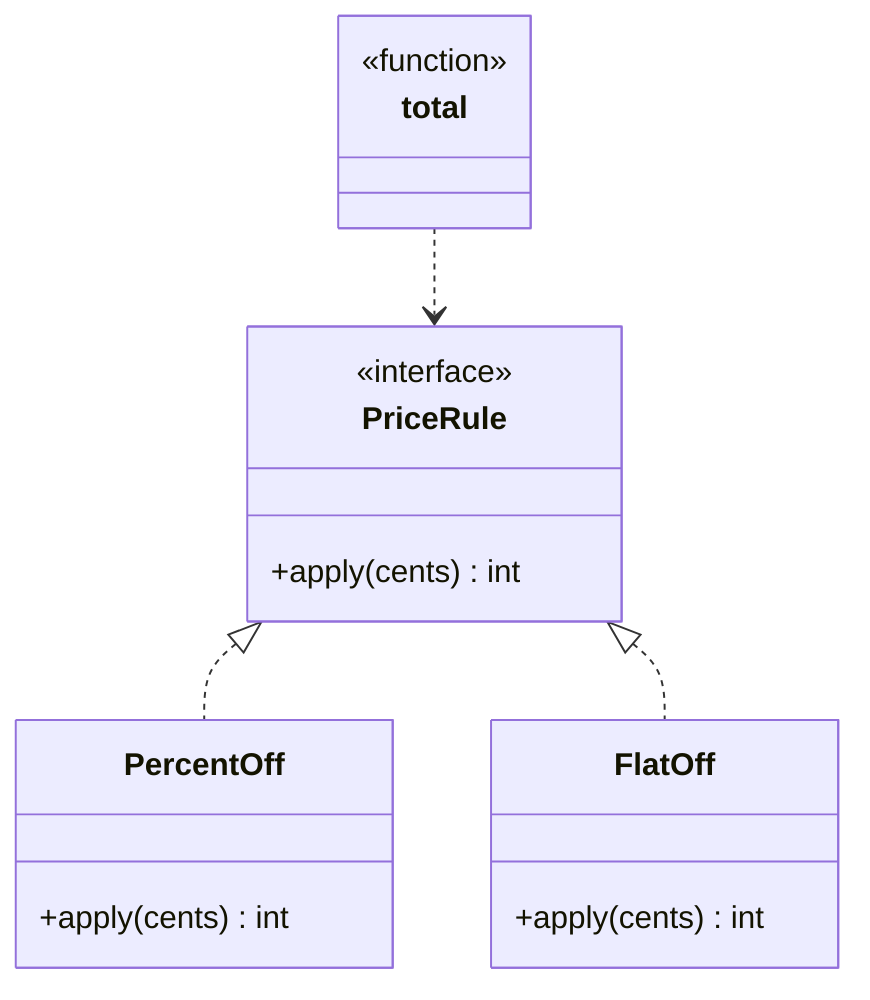

+++
title = 'Open/Closed Principle'
date = 2026-07-25
slug = 'open-closed-principle'
resources = ['glossary']
tags = ['solid', 'open-closed-principle', 'design']
toc = false
+++

The **Open/Closed Principle** (OCP) is the "O" in the
. It states that
a software entity should be _open for extension but closed for modification_ --
you should be able to add new behavior without editing the code that already
works. A `switch` that grows a new branch every time a variant is added is the
canonical violation.

<!--more-->

## Why it matters

Every time you edit working code to bolt on a new case, you risk breaking the
cases that were already there, and you introduce more work.
A function that dispatches on a kind with a `switch` becomes a chokepoint: each
new feature reopens it, re-tests everything around it, and collides with anyone
else extending the same list. The code is never "done" -- it grows without bound
in place.

"Closed for modification" means the existing, tested code stays untouched; "open
for extension" means new behavior arrives as _new_ code -- a new type
implementing an existing abstraction. The consumer iterates over the
abstraction and never learns of the new variant, so adding one cannot regress
the old ones. This is what lets a codebase grow by accretion instead of by
constant surgery on its core.

## Example

Consider pricing an order by applying a series of discounts. Dispatching on a
discount "kind" works until the second discount type, and then every new kind
means editing the pricing function itself.




```cpp
enum class DiscountKind { PercentOff, FlatOff };

struct Discount {
  DiscountKind kind;
  int value;
};

auto total(int base, const std::vector<Discount>& discounts) -> int {
  int result = base;
  for (const auto& discount : discounts) {
    switch (discount.kind) {
      case DiscountKind::PercentOff:
        result = result * (100 - discount.value) / 100;
        break;
      case DiscountKind::FlatOff:
        result = std::max(0, result - discount.value);
        break;
    }
  }
  return result;
}
```




```go
package pricing

type DiscountKind int

const (
  PercentOff DiscountKind = iota
  FlatOff
)

type Discount struct {
  Kind  DiscountKind
  Value int
}

func Total(base int, discounts []Discount) int {
  result := base
  for _, discount := range discounts {
    switch discount.Kind {
    case PercentOff:
      result = result * (100 - discount.Value) / 100
    case FlatOff:
      result = max(0, result-discount.Value)
    }
  }
  return result
}
```




```python
from dataclasses import dataclass
from enum import Enum, auto


class DiscountKind(Enum):
  PERCENT_OFF = auto()
  FLAT_OFF = auto()


@dataclass(frozen=True)
class Discount:
  kind: DiscountKind
  value: int


def total(base: int, discounts: list[Discount]) -> int:
  result = base
  for discount in discounts:
    if discount.kind is DiscountKind.PERCENT_OFF:
      result = result * (100 - discount.value) // 100
    elif discount.kind is DiscountKind.FLAT_OFF:
      result = max(0, result - discount.value)
  return result
```




```rust
pub enum Discount {
  PercentOff(u32),
  FlatOff(u32),
}

pub fn total(base: u32, discounts: &[Discount]) -> u32 {
  let mut result = base;
  for discount in discounts {
    result = match discount {
      Discount::PercentOff(percent) => result * (100 - percent) / 100,
      Discount::FlatOff(amount) => result.saturating_sub(*amount),
    };
  }
  result
}
```




A "buy one, get one" or "loyalty tier" discount cannot be added without reopening
`total`, extending the enum, and adding another branch -- so the function is a
magnet for change.

Inverting the dependency fixes it. A `PriceRule` abstraction with a single
`apply` method lets each discount be its own type, and `total` folds the rules
over the running amount without knowing which kinds exist.




```cpp
class PriceRule {
public:
  virtual ~PriceRule() = default;
  virtual auto apply(int cents) const -> int = 0;
};

class PercentOff final : public PriceRule {
public:
  explicit PercentOff(int percent) : m_percent(percent) {}
  auto apply(int cents) const -> int override {
    return cents * (100 - m_percent) / 100;
  }

private:
  int m_percent;
};

class FlatOff final : public PriceRule {
public:
  explicit FlatOff(int amount) : m_amount(amount) {}
  auto apply(int cents) const -> int override {
    return std::max(0, cents - m_amount);
  }

private:
  int m_amount;
};

auto total(int base, const std::vector<const PriceRule*>& rules) -> int {
  int result = base;
  for (const auto* rule : rules) {
    result = rule->apply(result);
  }
  return result;
}
```




```go
package pricing

type PriceRule interface {
  Apply(cents int) int
}

type PercentOff struct{ Percent int }

func (p PercentOff) Apply(cents int) int {
  return cents * (100 - p.Percent) / 100
}

type FlatOff struct{ Amount int }

func (f FlatOff) Apply(cents int) int {
  return max(0, cents-f.Amount)
}

func Total(base int, rules []PriceRule) int {
  result := base
  for _, rule := range rules {
    result = rule.Apply(result)
  }
  return result
}
```




```python
from dataclasses import dataclass
from typing import Protocol


class PriceRule(Protocol):
  def apply(self, cents: int) -> int: ...


@dataclass(frozen=True)
class PercentOff:
  percent: int

  def apply(self, cents: int) -> int:
    return cents * (100 - self.percent) // 100


@dataclass(frozen=True)
class FlatOff:
  amount: int

  def apply(self, cents: int) -> int:
    return max(0, cents - self.amount)


def total(base: int, rules: list[PriceRule]) -> int:
  result = base
  for rule in rules:
    result = rule.apply(result)
  return result
```




```rust
pub trait PriceRule {
  fn apply(&self, cents: u32) -> u32;
}

pub struct PercentOff {
  pub percent: u32,
}

impl PriceRule for PercentOff {
  fn apply(&self, cents: u32) -> u32 {
    cents * (100 - self.percent) / 100
  }
}

pub struct FlatOff {
  pub amount: u32,
}

impl PriceRule for FlatOff {
  fn apply(&self, cents: u32) -> u32 {
    cents.saturating_sub(self.amount)
  }
}

pub fn total(base: u32, rules: &[Box<dyn PriceRule>]) -> u32 {
  rules.iter().fold(base, |cents, rule| rule.apply(cents))
}
```




A new discount is now a new type implementing `PriceRule`; `total` and every
existing rule stay exactly as they are:



OCP here rests on the other principles. `total` depends on the `PriceRule`
abstraction rather than concrete discounts, which is
;
that abstraction carries a single method, satisfying
;
and each rule does one thing, satisfying
.
The extension is only _safe_ because every rule honors the same contract -- take
a price, return a price no greater than it -- which is exactly

at work.

## References

*  -- Martin on why abstraction is the mechanism
  that makes code closed to modification yet open to extension.
*  -- covers both Meyer's original inheritance-based form
  and Martin's polymorphic form.
