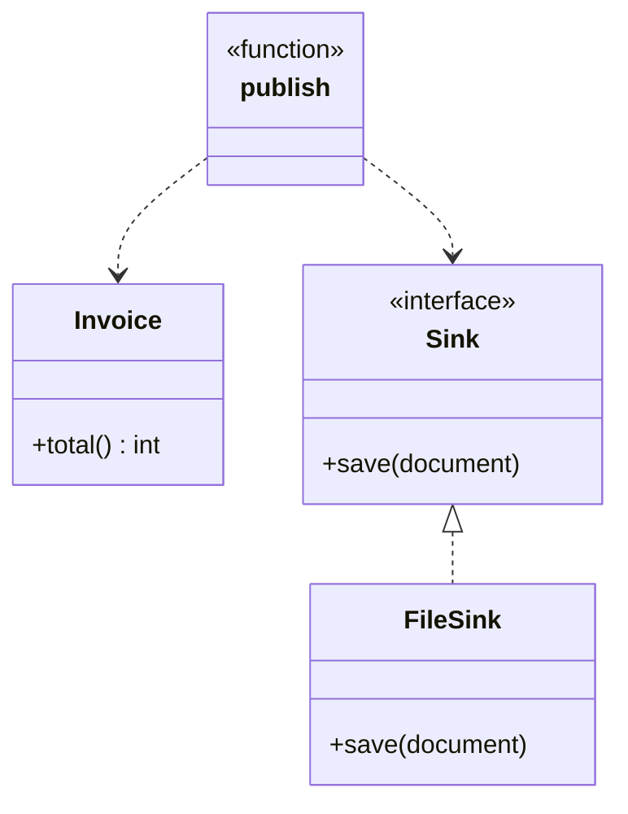

+++
title = 'Single Responsibility Principle'
date = 2026-07-25
slug = 'single-responsibility-principle'
url = '/glossary/single-responsibility-principle'
resources = ['glossary']
tags = ['solid', 'single-responsibility-principle', 'design']
toc = false
+++

The **Single Responsibility Principle** (SRP) is the "S" in the
. It states that
a unit of code should have exactly one _reason to change_ -- that is, it should
answer to a single actor or concern. A class that computes prices, formats a
document, and writes files has three reasons to change, and therefore violates
it.

<!--more-->

## Why it matters

"Reason to change" is the key phrase. A unit that serves several concerns
becomes a place where unrelated changes collide: a pricing rule change, a
layout tweak, and a switch from files to a database all land in the same class,
and each edit risks breaking the others. The concerns are coupled only because
they happen to live together, not because they belong together.

That coupling has concrete costs. Tests balloon, because you cannot exercise the
pricing logic without also dragging in file I/O. Reuse is blocked, because the
formatting you want elsewhere is welded to storage you do not want. And merge
conflicts multiply, because two people touching two unrelated concerns keep
editing the same file. Splitting a unit so each has one responsibility makes
each one small, independently testable, and safe to change in isolation.


When designing your abstractions, consider what your unit's
 are.

If you find that your design necessitates any **non-essential collaborators**
to do the work, it's a strong indication that it has _too many responsibilities_
and fails SRP. Reworking the abstraction to break out these responsibilities
might help.


## Example

Consider an invoice that has to be totalled, rendered as text, and saved.
Bundling all three into one type looks convenient, but it fuses three concerns
that change for entirely different reasons.




```cpp
struct Line {
  std::string sku;
  int quantity;
  int unit_price;
};

// Three reasons to change live here: pricing, presentation, and storage.
class InvoiceReport {
public:
  explicit InvoiceReport(std::vector<Line> lines) : m_lines(std::move(lines)) {}

  auto publish(const std::string& path) -> void {
    int total = 0;
    for (const auto& line : m_lines) {
      total += line.unit_price * line.quantity;
    }

    std::string text = "INVOICE\n";
    for (const auto& line : m_lines) {
      text += std::format("{} x{} = {}\n", line.sku, line.quantity,
                          line.unit_price * line.quantity);
    }
    text += std::format("TOTAL {}\n", total);

    std::ofstream out(path);
    out << text;
  }

private:
  std::vector<Line> m_lines;
};
```




```go
package billing

type Line struct {
  SKU       string
  Quantity  int
  UnitPrice int
}

// InvoiceReport prices, formats, and stores -- three reasons to change.
type InvoiceReport struct {
  Lines []Line
}

func (r InvoiceReport) Publish(path string) error {
  total := 0
  for _, line := range r.Lines {
    total += line.UnitPrice * line.Quantity
  }

  text := "INVOICE\n"
  for _, line := range r.Lines {
    text += fmt.Sprintf("%s x%d = %d\n", line.SKU, line.Quantity, line.UnitPrice*line.Quantity)
  }
  text += fmt.Sprintf("TOTAL %d\n", total)

  return os.WriteFile(path, []byte(text), 0o644)
}
```




```python
from dataclasses import dataclass


@dataclass(frozen=True)
class Line:
  sku: str
  quantity: int
  unit_price: int


# Three reasons to change live here: pricing, presentation, and storage.
class InvoiceReport:
  def __init__(self, lines: list[Line]) -> None:
    self._lines = lines

  def publish(self, path: str) -> None:
    total = sum(line.unit_price * line.quantity for line in self._lines)

    text = "INVOICE\n"
    for line in self._lines:
      text += f"{line.sku} x{line.quantity} = {line.unit_price * line.quantity}\n"
    text += f"TOTAL {total}\n"

    with open(path, "w") as out:
      out.write(text)
```




```rust
pub struct Line {
  pub sku: String,
  pub quantity: u32,
  pub unit_price: u32,
}

/// InvoiceReport prices, formats, and stores -- three reasons to change.
pub struct InvoiceReport {
  pub lines: Vec<Line>,
}

impl InvoiceReport {
  pub fn publish(&self, path: &str) -> std::io::Result<()> {
    let total: u32 = self.lines.iter().map(|l| l.unit_price * l.quantity).sum();

    let mut text = String::from("INVOICE\n");
    for line in &self.lines {
      text += &format!("{} x{} = {}\n", line.sku, line.quantity, line.unit_price * line.quantity);
    }
    text += &format!("TOTAL {}\n", total);

    std::fs::write(path, text)
  }
}
```




Everything hangs off one method. Accounting changing how a line is priced, a
designer changing the layout, and ops moving from files to a database all edit
`publish`, and each has to re-read the other two concerns to be sure it did no
harm.

Splitting those concerns gives each one a home. The `Invoice` knows its own
amount, a `render` function owns presentation, and persistence sits behind a
single-method `Sink` the caller supplies -- so a thin `publish` just wires them
together:



In code, that'd look like:




```cpp
struct Line {
  std::string sku;
  int quantity;
  int unit_price;
};

class Invoice {
public:
  explicit Invoice(std::vector<Line> lines) : m_lines(std::move(lines)) {}

  auto total() const -> int {
    int sum = 0;
    for (const auto& line : m_lines) {
      sum += line.unit_price * line.quantity;
    }
    return sum;
  }

  auto lines() const -> const std::vector<Line>& { return m_lines; }

private:
  std::vector<Line> m_lines;
};

auto render(const Invoice& invoice) -> std::string {
  std::string text = "INVOICE\n";
  for (const auto& line : invoice.lines()) {
    text += std::format("{} x{} = {}\n", line.sku, line.quantity,
                        line.unit_price * line.quantity);
  }
  text += std::format("TOTAL {}\n", invoice.total());
  return text;
}

class Sink {
public:
  virtual ~Sink() = default;
  virtual auto save(const std::string& document) -> void = 0;
};

auto publish(const Invoice& invoice, Sink& sink) -> void {
  sink.save(render(invoice));
}
```




```go
package billing

type Line struct {
  SKU       string
  Quantity  int
  UnitPrice int
}

type Invoice struct {
  Lines []Line
}

func (i Invoice) Total() int {
  total := 0
  for _, line := range i.Lines {
    total += line.UnitPrice * line.Quantity
  }
  return total
}

func Render(invoice Invoice) string {
  text := "INVOICE\n"
  for _, line := range invoice.Lines {
    text += fmt.Sprintf("%s x%d = %d\n", line.SKU, line.Quantity, line.UnitPrice*line.Quantity)
  }
  return text + fmt.Sprintf("TOTAL %d\n", invoice.Total())
}

type Sink interface {
  Save(document string) error
}

func Publish(invoice Invoice, sink Sink) error {
  return sink.Save(Render(invoice))
}
```




```python
from dataclasses import dataclass
from typing import Protocol


@dataclass(frozen=True)
class Line:
  sku: str
  quantity: int
  unit_price: int


@dataclass(frozen=True)
class Invoice:
  lines: list[Line]

  def total(self) -> int:
    return sum(line.unit_price * line.quantity for line in self.lines)


def render(invoice: Invoice) -> str:
  text = "INVOICE\n"
  for line in invoice.lines:
    text += f"{line.sku} x{line.quantity} = {line.unit_price * line.quantity}\n"
  return text + f"TOTAL {invoice.total()}\n"


class Sink(Protocol):
  def save(self, document: str) -> None: ...


def publish(invoice: Invoice, sink: Sink) -> None:
  sink.save(render(invoice))
```




```rust
pub struct Line {
  pub sku: String,
  pub quantity: u32,
  pub unit_price: u32,
}

pub struct Invoice {
  pub lines: Vec<Line>,
}

impl Invoice {
  pub fn total(&self) -> u32 {
    self.lines.iter().map(|l| l.unit_price * l.quantity).sum()
  }
}

pub fn render(invoice: &Invoice) -> String {
  let mut text = String::from("INVOICE\n");
  for line in &invoice.lines {
    text += &format!("{} x{} = {}\n", line.sku, line.quantity, line.unit_price * line.quantity);
  }
  text += &format!("TOTAL {}\n", invoice.total());
  text
}

pub trait Sink {
  fn save(&self, document: &str);
}

pub fn publish(invoice: &Invoice, sink: &impl Sink) {
  sink.save(&render(invoice));
}
```




Each concern now changes on its own axis, and the wiring depends on the `Sink`
abstraction rather than the filesystem.

This split does more than satisfy SRP. Because `publish` depends on the `Sink`
abstraction rather than the filesystem, a `FileSink`, an S3 sink, or an in-memory
sink for a test all drop in without touching `publish` -- that is

and  falling out
for free. `Sink` has a single method, so it satisfies
,
and any sink that honors "persist the document" is
 for
another. A design that respects one SOLID principle tends to respect the rest.

## References

*  -- Martin's article framing the principle
  around "one reason to change" and the actors behind that change.
*  -- overview with history and related principles.
