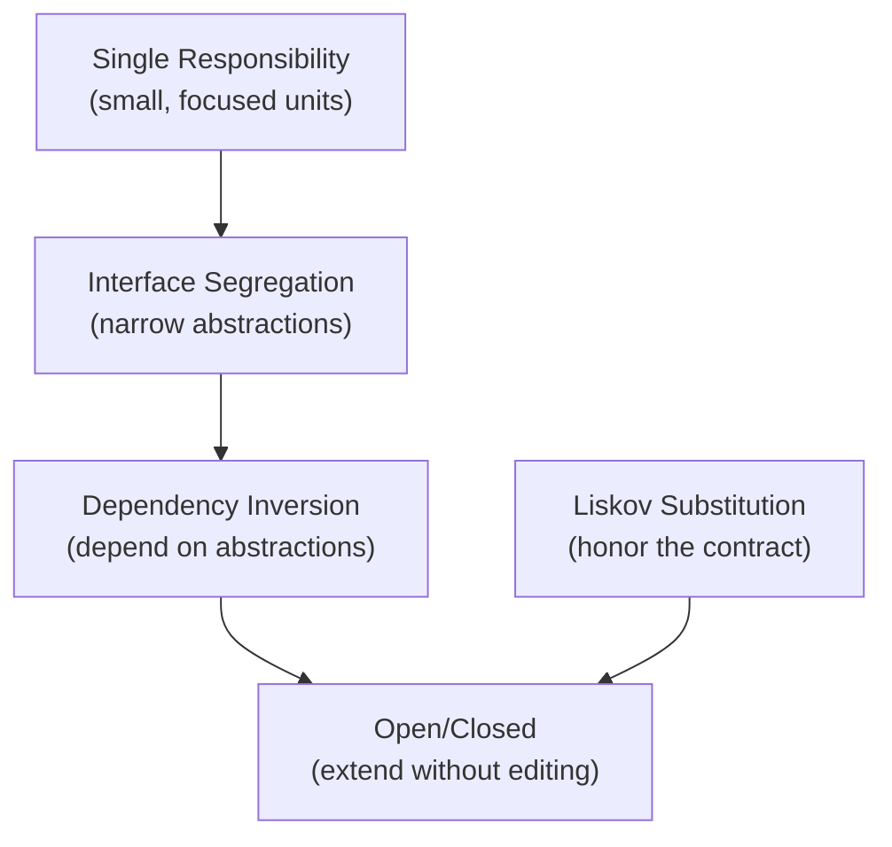

+++
title = 'SOLID Principles'
date = 2026-07-25
slug = 'solid-principles'
resources = ['glossary']
tags = ['solid', 'design', 'architecture']
toc = false
+++

**SOLID** is a set of five object-oriented design principles, popularized by
Robert C. Martin, for structuring code so that it tolerates change without
cascading edits. Each principle attacks a specific way a design goes rigid: a
class that changes for too many reasons, a module you cannot extend without
editing, a subtype that breaks its callers, an interface that forces dead code
on its implementers, or a high-level policy welded to a low-level detail.

<!--more-->

The payoff is practical. Code that follows SOLID localizes change (an edit stays
in one place), supports substitution (you can swap an implementation without the
caller noticing), and is testable almost for free -- the same seams that let you
inject a real  let a test
inject a  via
.

The five principles are:

* ****
  (SRP) -- a class should have one reason to change; keep one responsibility per
  unit.
* ****
  (OCP) -- open for extension, closed for modification; add behavior without
  editing existing code.
* ****
  (LSP) -- a subtype must be usable anywhere its supertype is, without breaking
  the caller's expectations.
* ****
  (ISP) -- no client should be forced to depend on methods it does not use;
  prefer small, focused abstractions.
* ****
  (DIP) -- depend on abstractions, not concretions; both high- and low-level
  modules depend on the interface between them.

They are not five unrelated rules -- they reinforce each other. SRP keeps units
small enough to have a clear contract. ISP keeps the abstractions those units
depend on narrow, and DIP points that dependency at an abstraction rather than a
concrete type -- together they make a unit _open for extension_ (OCP), because a
new implementation plugs in without editing the consumer. LSP is what makes that
substitution _safe_: extension only works if every implementation actually
honors the abstraction's contract.

## References

*  -- the paper that collected these principles;
  the origin of the SOLID grouping.
*  -- overview of the acronym and each principle with
  further references.
*  -- Martin's retrospective on what the
  principles are actually about and where they still apply.
