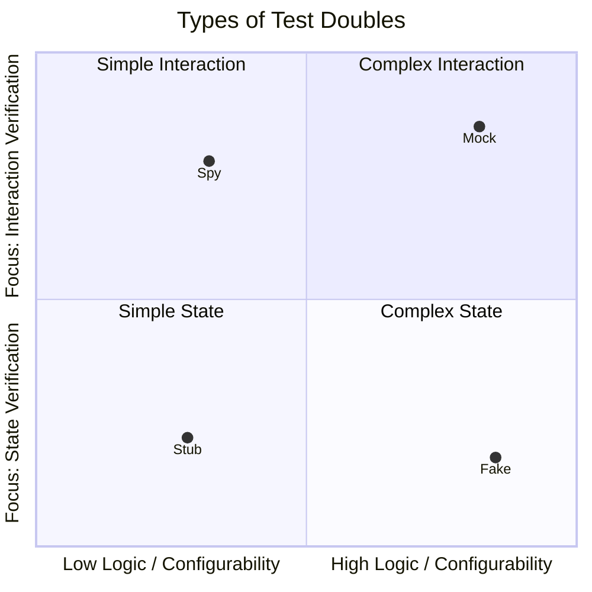
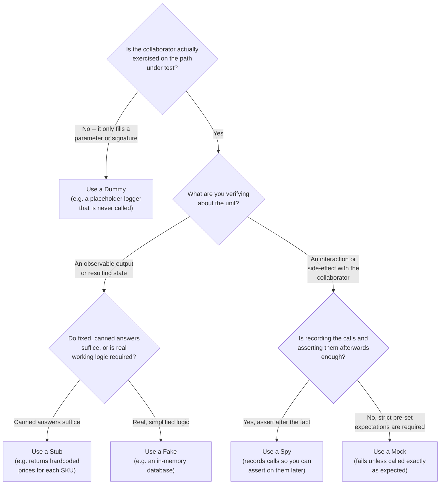

+++
title = 'Test Double'
date = 2026-06-26
slug = 'test-double'
resources = ['glossary']
tags = ['test-double', 'testing']
toc = false
+++

**Test double** is the umbrella term for any object that stands in for a real
 during a test -- just
as a stunt double stands in for an actor. The family includes dummies, stubs,
spies, fakes, and , each substituting a
real dependency to keep the unit under test isolated and deterministic.

<!--more-->

Test doubles allow a collaborator to be
 rather than
constructed internally.

## The family

The term covers a spectrum of substitutes, ordered here roughly from least to
most behavior:

* **** -- a "do nothing" implementation
  that is just a stand-in. Dummies do not verify anything.

* **** -- returns canned answers to the
  calls made during a test. It has no assertions of its own. Focuses on
  **State verification**. Generaly has minimal complexity and configurability.

* **** -- a real, working implementation
  that takes a shortcut unsuitable for production, such as an in-memory store
  standing in for a database. Focuses on **State verification** with medium
  configurability and high complexity.

* **** -- a stub that also records _how_
  it was called, so the test can inspect those calls afterwards. Focuses on
  **Interaction verification** and has low to medium configurability and
  complexity.

* **** -- preconfigured with
  _expectations_ about the calls it should receive, and fails the test if those
  expectations are not met. Focuses on **Interaction verification** and has
  medium to high configuration and complexity.

The family can be represented graphically in the following manner:




 does not appear in the graph.
This is because it verifies nothing, and generally carries no logic, so it has
no place on either axis -- it is the degenerate member of the family.


## Deciding which Test Double to use

There are two ways to verify a unit's behavior, and this drives which double
is most appropriate:

1. **State verification**, which asks _"what is the observable result of the
  action?"_ and inspects the outcome.
2. **Interaction verification**, which asks "which calls did the unit make?" and
  inspects the conversation between collaborators.

_State verification_ is almost always the better default, because it asserts on
the observable _behavior_ of the system rather than its _implementation_. A test
that only checks "method `X` was called with argument `Y`" is coupled to _how_
the code currently works; rename the method, batch two calls into one, reorder
the steps, or even just refactor into a whole new implementation -- and the test
breaks even though the behavior is unchanged.

For that reason, prefer the most _realistic_ double that still keeps the test
deterministic. A  or a
 is _usually_ the better choice because
it behaves like the real collaborator -- returning real answers to real inputs
-- so the test can assert on a genuine outcome instead of a call log.

_Interaction verification_ is better reserved for testing a _side effect_ that
cannot be observed otherwise from the state. For example, verifying that an
`Observer` is notified from a `Subjet`/`Observer` pattern -- since this
typically does not provide any visible state otherwise. An interaction like this
is best handled through a  to confirm
that it's called as expected. Finally there are
, which are useful for when you really
need to confirm that things are called in a certain way or a certain order; but
this often generates high-coupling and should be used sparingly.

To represent this decision process graphically, consult the decision-tree below:



## Example

Consider a `total` function that prices an order through a `Catalog` abstraction.
A  would assert that the catalog was
asked for each SKU -- pinning the lookup logic in place. A
 catalog with real prices lets the test
assert what actually matters: the total that comes out. The double stays out of
the assertion entirely; only the observable result is checked.




```cpp
// checkout.hpp -- the abstraction and the unit under test.

// Catalog yields the unit price, in cents, of a product.
class Catalog {
public:
  virtual ~Catalog() = default;
  virtual auto unit_price(const std::string& sku) const -> int = 0;
};

struct Line {
  std::string sku;
  int quantity;
};

auto total(const Catalog& catalog, const std::vector<Line>& lines) -> int;
```

```cpp
// A fake: a working Catalog backed by a map of fixed prices.
class FakeCatalog final : public Catalog {
public:
  explicit FakeCatalog(std::map<std::string, int> prices)
    : m_prices(std::move(prices)) {}

  auto unit_price(const std::string& sku) const -> int override {
    return m_prices.at(sku);
  }

private:
  std::map<std::string, int> m_prices;
};

TEST_CASE("total sums the priced line items") {
  // Arrange
  const FakeCatalog catalog{{{"APPLE", 50}, {"BREAD", 220}}};
  const std::vector<Line> lines{{"APPLE", 3}, {"BREAD", 1}};

  // Act
  const int result = total(catalog, lines);

  // Assert
  REQUIRE(result == 370);
}
```




```go
package checkout

// Catalog yields the unit price, in cents, of a product.
type Catalog interface {
  UnitPrice(sku string) int
}

// Line is a requested quantity of a product.
type Line struct {
  SKU      string
  Quantity int
}

// Total returns the price, in cents, of the given lines.
func Total(catalog Catalog, lines []Line) int {
  var total int
  for _, line := range lines {
    total += catalog.UnitPrice(line.SKU) * line.Quantity
  }
  return total
}
```

```go
package checkout_test // external package: only the exported API is visible

// fakeCatalog is a working Catalog backed by a table of fixed prices.
type fakeCatalog map[string]int

func (c fakeCatalog) UnitPrice(sku string) int { return c[sku] }

func TestTotal(t *testing.T) {
  t.Parallel()

  // Arrange
  catalog := fakeCatalog{"APPLE": 50, "BREAD": 220}
  testCases := []struct {
    name  string
    lines []checkout.Line
    want  int
  }{
    {
      name:  "sums the priced line items",
      lines: []checkout.Line{{SKU: "APPLE", Quantity: 3}, {SKU: "BREAD", Quantity: 1}},
      want:  370,
    }, {
      name:  "an empty order costs nothing",
      lines: nil,
      want:  0,
    },
  }

  for _, tc := range testCases {
    t.Run(tc.name, func(t *testing.T) {
      // Act
      total := checkout.Total(catalog, tc.lines)

      // Assert
      if got, want := total, tc.want; !cmp.Equal(got, want) {
        t.Errorf("Total(%v) = %d, want %d", tc.lines, got, want)
      }
    })
  }
}
```




```python
# checkout.py -- the abstraction and the unit under test.
from dataclasses import dataclass
from typing import Protocol


# Catalog yields the unit price, in cents, of a product.
class Catalog(Protocol):
  def unit_price(self, sku: str) -> int: ...


@dataclass(frozen=True)
class Line:
  sku: str
  quantity: int


def total(catalog: Catalog, lines: list[Line]) -> int:
  return sum(catalog.unit_price(line.sku) * line.quantity for line in lines)
```

```python
from checkout import Line, total


# A fake: a working Catalog backed by a dict of fixed prices.
class FakeCatalog:
  def __init__(self, prices: dict[str, int]) -> None:
    self._prices = prices

  def unit_price(self, sku: str) -> int:
    return self._prices[sku]


def test_total_sums_the_priced_line_items():
  # Arrange
  catalog = FakeCatalog({"APPLE": 50, "BREAD": 220})
  lines = [Line("APPLE", 3), Line("BREAD", 1)]

  # Act
  result = total(catalog, lines)

  # Assert
  assert result == 370
```




```rust
// src/lib.rs -- the abstraction and the unit under test.

/// Catalog yields the unit price, in cents, of a product.
pub trait Catalog {
  fn unit_price(&self, sku: &str) -> u32;
}

pub struct Line {
  pub sku: String,
  pub quantity: u32,
}

/// Returns the price, in cents, of the given lines.
pub fn total(catalog: &impl Catalog, lines: &[Line]) -> u32 {
  lines
    .iter()
    .map(|line| catalog.unit_price(&line.sku) * line.quantity)
    .sum()
}
```

```rust
// tests/checkout.rs -- a separate crate that sees only the public API.
use std::collections::HashMap;

use checkout::{total, Catalog, Line};

// A fake: a working Catalog backed by a map of fixed prices.
struct FakeCatalog(HashMap<String, u32>);

impl Catalog for FakeCatalog {
  fn unit_price(&self, sku: &str) -> u32 {
    self.0[sku]
  }
}

#[test]
fn total_sums_the_priced_line_items() {
  // Arrange
  let catalog = FakeCatalog(HashMap::from([
    ("APPLE".to_string(), 50),
    ("BREAD".to_string(), 220),
  ]));
  let lines = [
    Line { sku: "APPLE".to_string(), quantity: 3 },
    Line { sku: "BREAD".to_string(), quantity: 1 },
  ];

  // Act
  let result = total(&catalog, &lines);

  // Assert
  assert_eq!(result, 370);
}
```





Notice the assertion names neither the catalog nor its `unit_price` calls -- it
checks only the total that comes out. The fake could cache, batch, or reorder its
lookups and the test would not care, because none of that is the behavior under
test.


## References

*  -- Fowler's article separating state verification
  from interaction verification, and the double taxonomy behind it.
*  -- Gerard Meszaros' canonical catalog of dummy,
  stub, spy, fake, and mock.
*  -- short overview of the term and its members.
